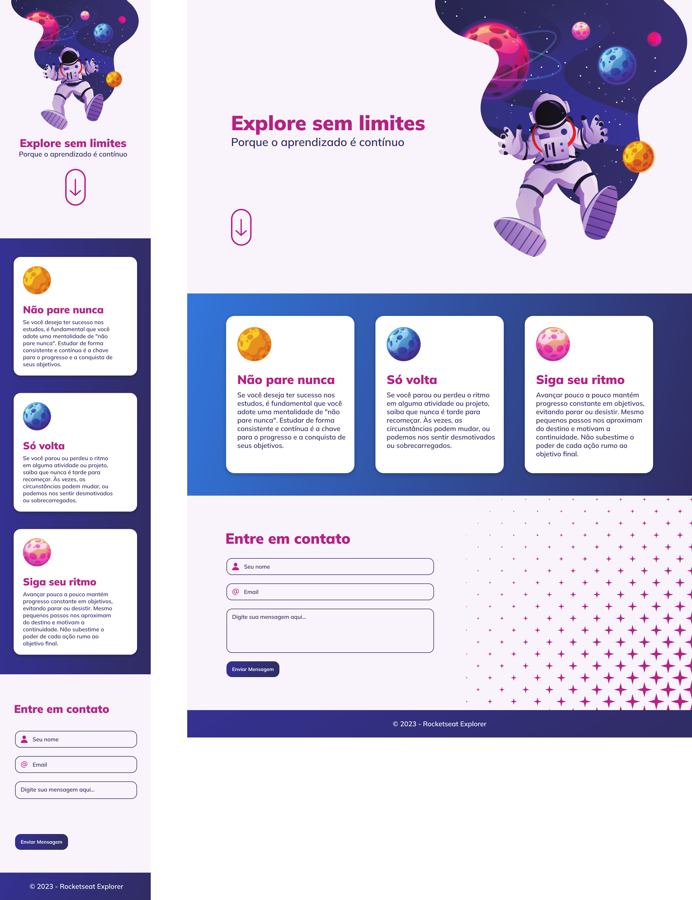

<!-- Banner session -->

  
  

   

<!-- About session -->
<h1 align="center" style="color:#8257e6">Explore Sem Limites</h1>

  Front-end desenvolvido na formação Explorer da <a href="https://www.rocketseat.com.br/" target="_blank">Rocketseat</a>

   

  

 

<!-- Tools session -->
<h3> 🚀 Technologies </h3>

  <code></code>
  <code></code>
  <code></code>
  <code></code>

- [HTML](https://developer.mozilla.org/pt-BR/docs/Learn/Getting_started_with_the_web/HTML_basics) - hypertext markup language used in building web applications
- [CSS](https://developer.mozilla.org/pt-BR/docs/Web/CSS) - cascading style sheets is a language used for styling
- [JavaScript](https://developer.mozilla.org/pt-BR/docs/Learn/JavaScript/First_steps/What_is_JavaScript) - programming language that allows you to implement complex items in web pages

 

<!-- Learnning session -->
<h3> 👩‍💻 Learnings </h3>

You can see the project code in this [repository](
    https://github.com/MichelleCordeiro/rocketseat-explorer/tree/main/stage-01-04-intensivao/desafio-explore-sem-limites) and see it online [here](https://MichelleCordeiro.github.io/rocketseat-explorer/stage-01-04-intensivao/desafio-explore-sem-limites)
<table>
  <tr>
    <td>
      <li>HTML/ CSS </li>
      <li>Figma</li>
      <li>Grid x flexbox</li>
      <li>Responsive layout</li>
    </td>
    <td>
      <li>Google fonts</li>
      <li>Form</li>
      <li>Mobile first</li>
      <li>Media query</li>
    </td>
    <td>
      <li>Animations</li>
      <li>Filters</li>
      <li>Transitions</li>
      <li>Transforms</li>
      <li>CSS variables</li>
    </td>

  </tr>
</table>

 

<!-- Contacts session -->
<h3> 👩🏼‍💻 Contatos </h3>

  <strong>&emsp; Michelle Cordeiro</strong> &emsp;
  <a href="https://www.linkedin.com/in/michelle-cordeiro/">
     LinkedIn
  </a> &emsp;
  <a href="michelle8cordeiro@gmail.com">
    
    E-mail: michelle8cordeiro@gmail.com
  </a>

 

<!-- Licences session -->
<h3 align="left"> 📝 License </h3>

  
  

 
<!--END_SECTION:licenses-->

<!--START_SECTION:footer-->

  

Made with 💜 by <a href="https://www.linkedin.com/in/michelle-cordeiro/">Michelle Cordeiro</a>

<!--END_SECTION:footer-->
